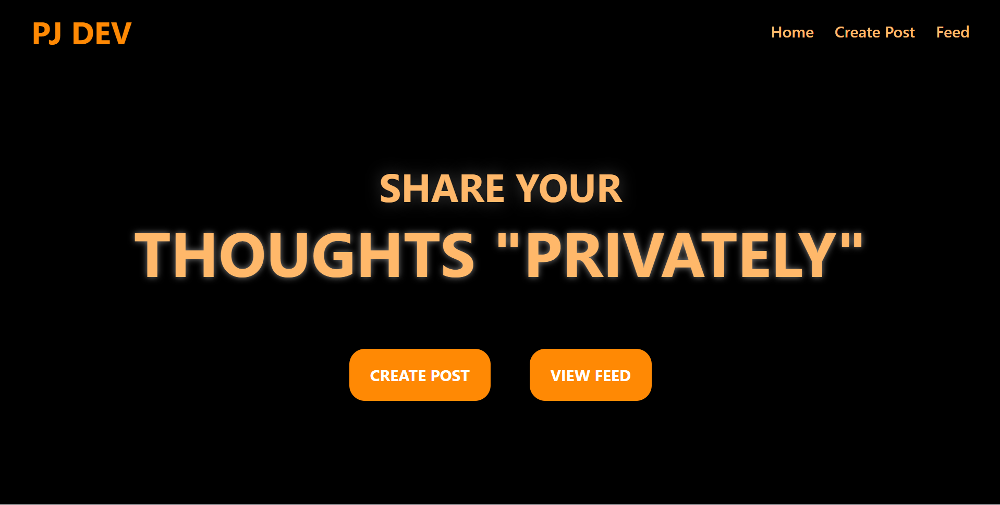
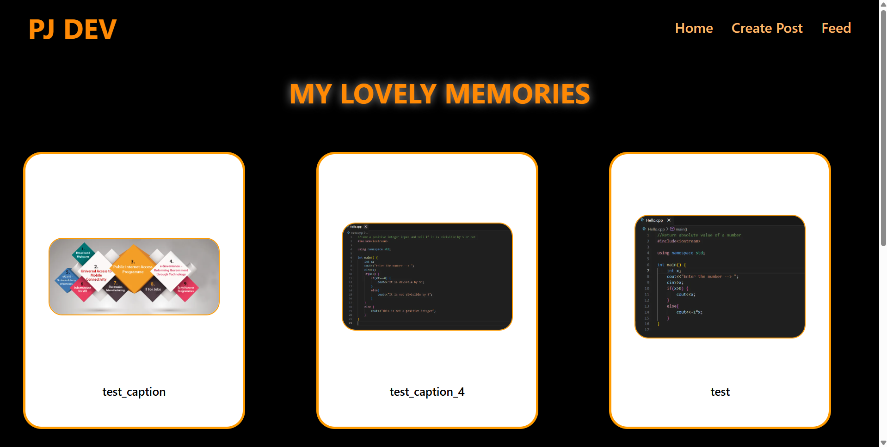

# MySphere

MySphere is a private social media inspired MERN application where you can create posts with images and captions and view them in your own personalized feed.

## Features

- Create posts with images and captions
- Upload and store images
- View all posts in a feed layout
- REST API integration
- MongoDB database storage

## Tech Stack

### Frontend
- React
- Tailwind CSS

### Backend
- Node.js
- Express.js
- MongoDB

## Screenshots

### Home Page


### Upload Feature


### Feed Feature


## Installation

Clone the repository:

```bash
git clone YOUR_REPO_LINK
```

Install frontend dependencies:

```bash
cd Frontend/frontend
npm install
```

Install backend dependencies:

```bash
cd backend
npm install
```

Start frontend:

```bash
npm run dev
```

Start backend:

```bash
npm start
```

## Environment Variables

Create a `.env` file in backend folder and take reference from `.env.example` file

## Future Improvements

- User authentication
- Like and comment system
- Edit/Delete posts
- Dark mode

## Author

Pratyush Jaiswal